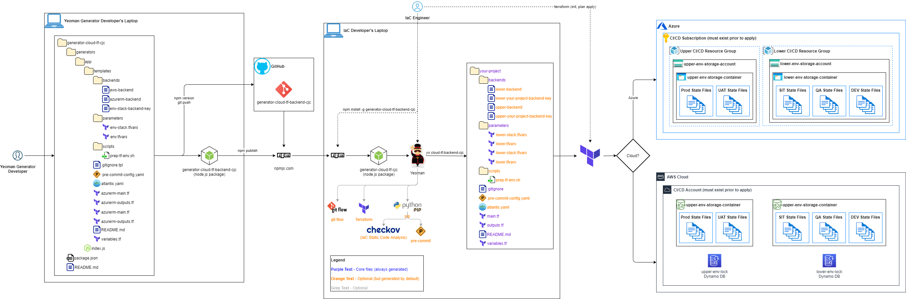

# Yeoman Generator - Cloud Terraform Scaffolding
## Overview

This Yeoman generator creates Terraform backend storage (to store terraform remote state)



### Supported Cloud Providers
- Azure
- AWS

### Actions taken by the generator

#### Prompting
- Asks for 
    - project metadata values 
    - target cloud provider
    - target cloud provider region
    - environments to be supported
        - choices include upper and lower (both selected by default)
    - common cloud resource tags

#### Writing
- Creates Cloud Backend Configuration Files (opinionated backend naming convention)
- Creates Backend Parameter Files
- Creates terraform templates files for terraform backends (Terraform main.tf, variables.tf, and output.tf files)

#### Installing
- initializes the local git repo (with either git or git flow)

#### Optionally installs the following
- python3-pip
- terraform 0.12.30

#### Optionally configures the following
- Git Flow
- Atlantis Workflow
- Pre-Commit Hooks for Terraform

### The resulting project will have the following structure:

```
backend_project
└───backends
|   |   lower-backend (default)
|   |   lower-project-backend-key (default)
|   |   upper-backend (default)
|   |   upper-project-backend-key (default)
└───parameters
|   |   lower-project.tfvars (default)
|   |   lower.tfvars (default)
|   |   upper-project.tfvars (default)
|   |   upper.tfvars (default)
└───scripts
|   |   prep-tf-env.sh (optional)
|   .gitignore
|   .pre-commit-config.yaml (optional)
|   atlantis.yaml (optional)
|   main.tf
|   outputs.tf
|   README.md
|   variables.tf
```

**Note:** The "-backend-key" files contain the object name for the terraform state per environment (upper - prod & uat, lower - sit, qa, dev).

## Usage

<ol>
<li> mkdir your_terraform_backend_project_directory
<li> cd your_terraform_backend_project_directory
<li> npm install -g generator-cloud-tf-backend-cjc
<li> yo cloud-tf-backend-cjc
</ol>

## Development
- TBD

### Prerequisites

- npm installed
- Yeoman installed
- Before the generated terraform backend project templates are used, credentials for either AWS or Azure must be in place.

### Configurations

- TBD


### Tests

- TBD

**Note:** As of 3/24/21 this generator has only been tested on Ubuntu.  Testing on additional operating systems coming soon.

## Authors
Charlie Christina